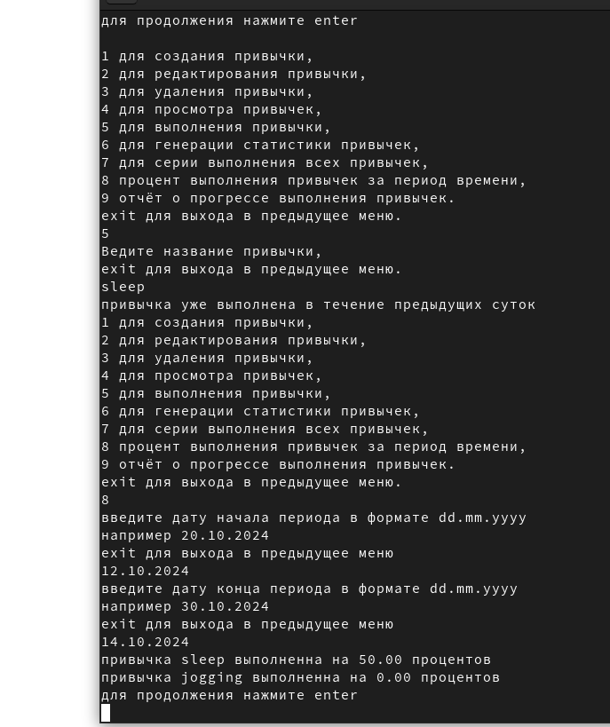
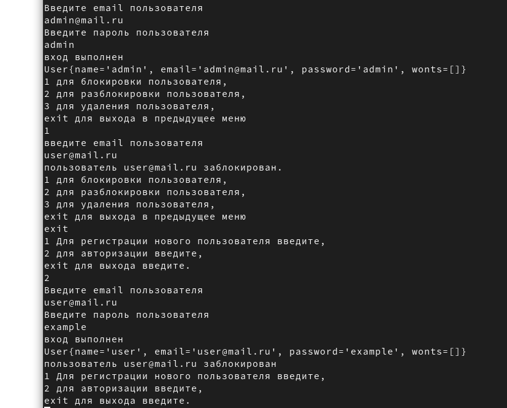

#  Проект привычки

   сделано crud привычек
   
   Для запуска приложения введите в терминале последовательно

   mvn clean

   mvn compile

   mvn exec:java -Dexec.mainClass="website.ylab.Main"
   
stack: java 17, junit 5, mockito, lombok

